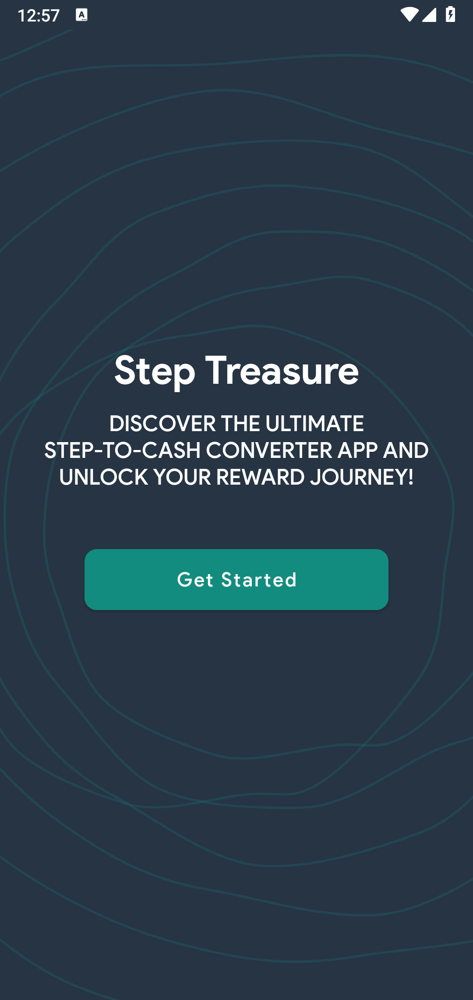
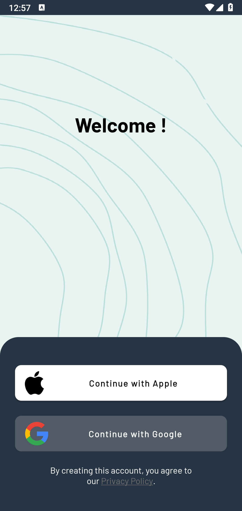
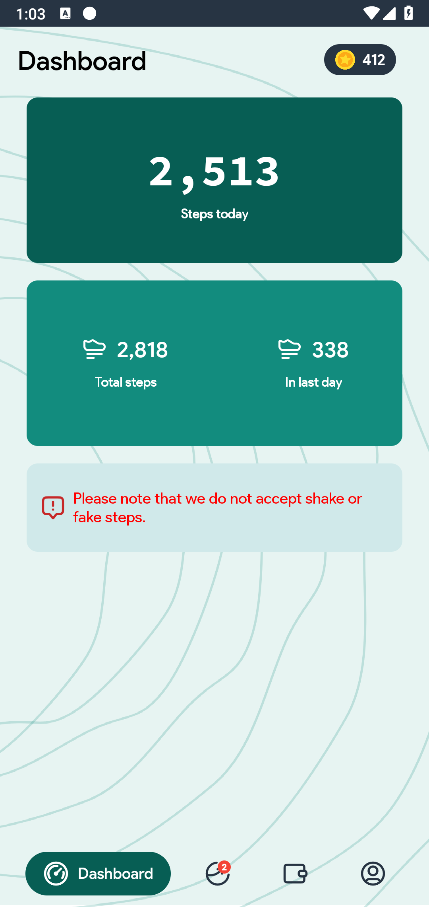
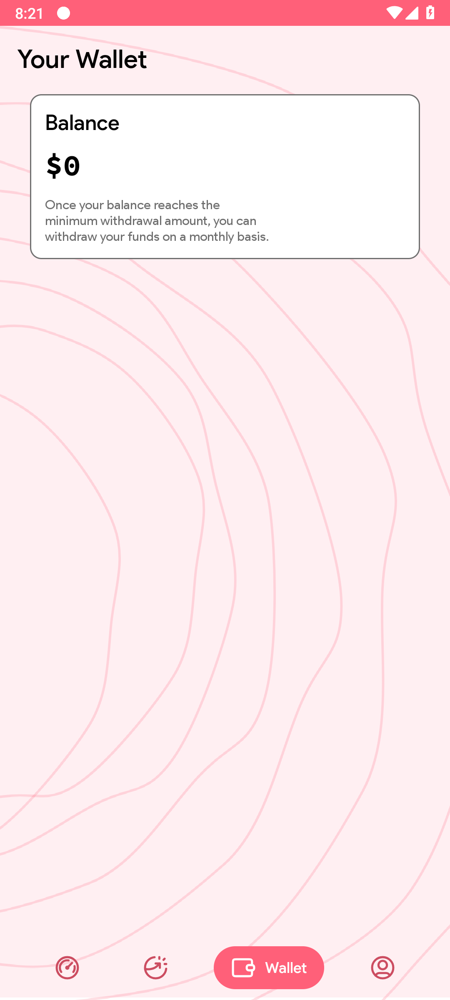
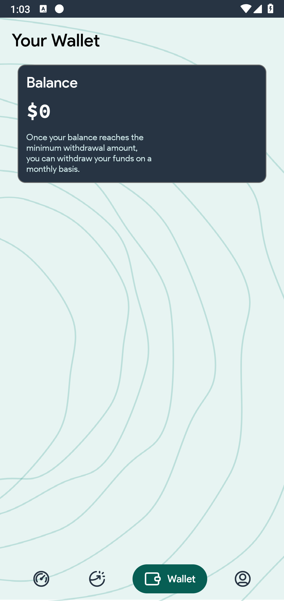
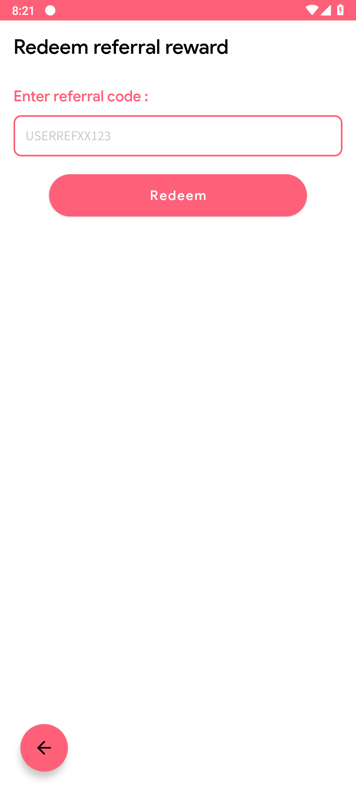

# WiniWalk

<!--  -->

<!--  -->

## Contributors

<!-- ALL-CONTRIBUTORS-LIST:START - Do not remove or modify this section -->
<!-- prettier-ignore-start -->
<!-- markdownlint-disable -->

<!-- markdownlint-restore -->
<!-- prettier-ignore-end -->

<!-- ALL-CONTRIBUTORS-LIST:END -->

<table>
  <tr>
    <td></td>
    <td>WiniWalk is a fun and motivating walking app designed to turn every step into a chance to win! Whether you're a fitness enthusiast or just looking to stay active, WiniWalk provides a unique and enjoyable way to track your walking progress while giving you the opportunity to earn rewards and prizes along the way.</td>
  </tr>
</table>

## Screenshots

<table>
  <tr>
    <td align="center">
      
    </td>
    <td align="center">
      
    </td>
    <td align="center">
      
    </td>
    <td align="center">
      
    </td>
  </tr>
  <tr>
    <td align="center">
      
    </td>
    <td align="center">
      
    </td>
    <td align="center">
      
    </td>
    <td align="center">
      
    </td>
  </tr>
</table>

## Features

- **Step Tracking**: WiniWalk accurately tracks your daily steps, distance covered, and calories burned, keeping you informed about your walking achievements.

- **Challenges and Rewards**: Participate in exciting walking challenges and earn rewards as you reach milestones. The more you walk, the more chances you have to win!

- **Referral**: Refer friends and family to join WiniWalk and receive bonuses or rewards when they sign up and start walking. It's a fun way to motivate others and earn together!

- **Walk History**: Keep a detailed history of your daily walks and view your progress over time. Analyze your walking patterns and set new goals based on your history.

- **Community and Competition**: Connect with friends and fellow walkers, create or join walking groups, and compete on leaderboards for friendly competition.

- **Firebase Integration**: Our app is powered by Firebase, ensuring a secure and real-time experience for our users. Your data is safe, and you can access your progress from multiple devices.

## Getting Started

To get started with WiniWalk on your Android device, follow these steps:

1. **Clone the Repository**: Clone this GitHub repository to your local machine using Git or download it as a ZIP file and extract it.

2. **Obtain `google-services.json`**:
   - Visit the [Firebase Console](https://console.firebase.google.com/).
   - Create a new Firebase project or use an existing one.
   - In your Firebase project, go to "Project settings" (click on the gear icon in the top left).
   - Under the "General" tab, scroll down to the "Your apps" section.
   - Click on the Android app icon (it looks like the Android logo).
   - Follow the setup steps, including providing your Android app's package name (found in your app's `build.gradle` file).
   - Download the `google-services.json` file provided during the setup process.

3. **Place `google-services.json` Under `app` Directory**:
   - Move the downloaded `google-services.json` file to the `app` directory in your project.

4. **Open in Android Studio or IntelliJ IDEA**:
   - If you're using Android Studio or IntelliJ IDEA, open the project by selecting `File` -> `Open` and selecting the project directory.

5. **Build the APK**:
   - Build the APK by clicking on the "Build" menu and then selecting "Build Bundle(s) / APK(s)" -> "Build APK(s)".

6. **Install on Your Device**:
   - Transfer the generated APK file to your Android device.
   - Enable "Install from Unknown Sources" in your device settings if not already enabled.
   - Use a file manager app to locate the APK file on your device and install it.

7. **Sign Up or Log In**:
   - Open the WiniWalk app on your Android device.
   - Sign up for a new account or log in if you already have one.

8. **Start Walking and Winning**:
   - Allow the app to access your device's step data for accurate tracking.
   - Start walking, set goals, and join challenges to win exciting rewards!

## Technologies Used

WiniWalk is built using a combination of Java, Kotlin, and Firebase, ensuring a robust and reliable walking experience. We use Firebase for real-time tracking and data storage to make your walking journey enjoyable and hassle-free.

## Feedback and Contributions

We welcome your feedback, suggestions, and contributions to make WiniWalk even better. If you encounter any issues or have ideas for improvement, please [create an issue](https://github.com/abdelillahbel/WiniWalkAndroid/issues) or [contribute to the project](https://github.com/abdelillahbel/WiniWalkAndroid/contribute).

## Authors

- [@abdelillahbel](https://www.github.com/abdelillahbel)

## License
This project is licensed under the GNU General Public License v3.0. See the [LICENSE](LICENSE) file for details.

---

Thank you for choosing WiniWalk to turn your steps into victories! Get ready to step, win, and walk your way to a healthier and more rewarding lifestyle.
